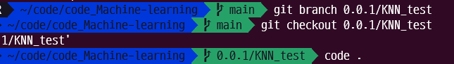
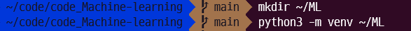
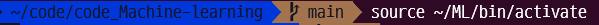
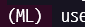
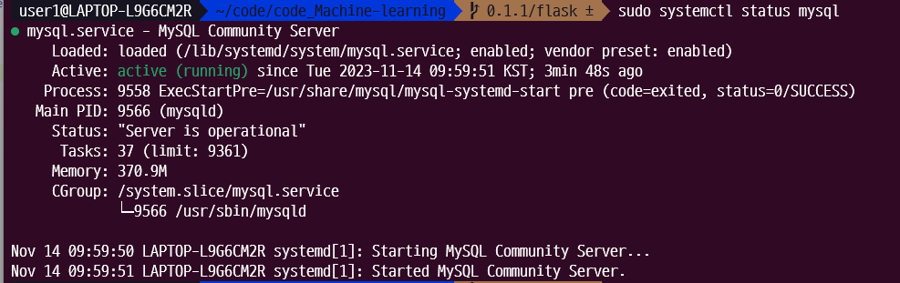

# code_Machine-learning
프로젝트 머신러닝 코드 repo

## START
#### linux와 git이 연결되어있지 않는 경우
```bash

$ git clone git@github.com:team-i-Five/code_Machine-learning.git
$ cd code_Machine-learning

# 폴더안에 .git이 없으면
$ git init

```


#### 항상 변경사항이 있는지 확인하기 위해
```bash

$ git pull
```

##### 테스트를 진행할 branch 생성
```bash

$ git branch 버전명/브랜치명
$ git checkout 생성한 버전명/브랜치명
```


##### 가상환경 생성
```bash

$ mkdir ~/ML
$ python3 -m venv ~/ML
$ source ~/ML/bin/activate
```




##### main 코드 branch로 가져오기
```bash

$ git pull origin main
```

#### vscode실행
```bash

$ code .
```

----
#### (rest server)flask 테스트
--flask 폴더 안 python 파일에서 실행--
1. flask 폴더 생성 및 flask 설치 
    pip install pymysql

--linux 프로젝트 폴더에서 실행--
2. MySQL 설치 확인
    sudo apt-get update
    sudo apt-get install mysql-server
3. MySQL 서버 시작
    sudo systemctl start mysql
4. MySQL 서비스 상태 확인
    sudo systemctl status mysql
